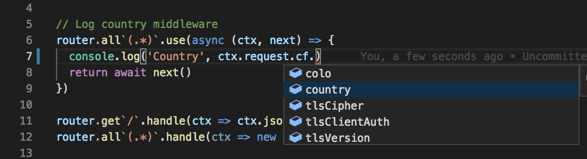
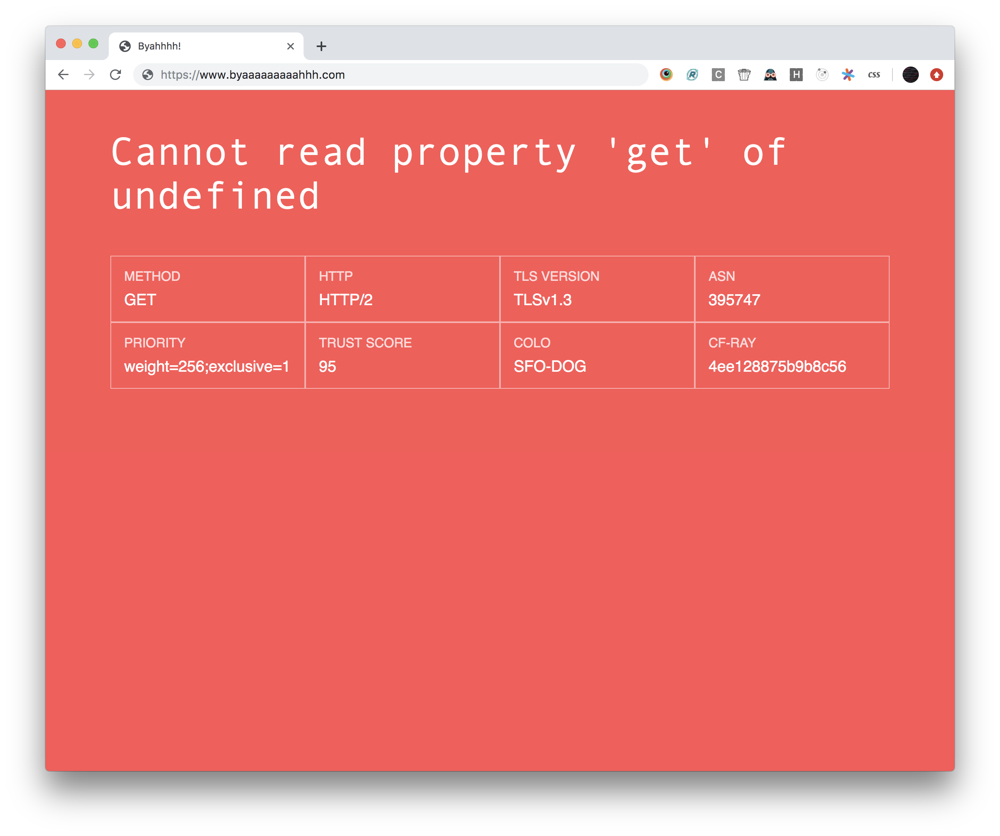

> __Warning!__ This is real old

# Cloudflare Workers Boilerplate



**Features**

- Strict TypeScript
- Webpack bundling
- Multiple worker targets
- Workers preview
- Testing
- Routing with async middleware example
- Error pages
- CI with Circle



**Coming soon**

- Preact + Edge-side rendering bundle
- Deployment
- KV Examples
- Web Assembly with Wrangler

### Getting started

Clone the repository and run:

```bash
# Install deps
yarn
# Build everything
yarn build
# Preview the api build
yarn preview:api
```

**Incremental builds and tests**

```bash
yarn build:watch & yarn test:watch
```

## Targets

This project is setup so that one may build multiple Service Worker targets

### Target: API

This targets demonstrates how one would create an HTTP API with Cloudflare Workers

### Target: Tests

Any file that ends with `_test.ts` or `_test.tsx` will be run through
